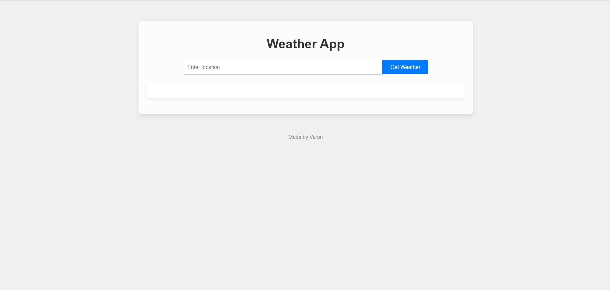
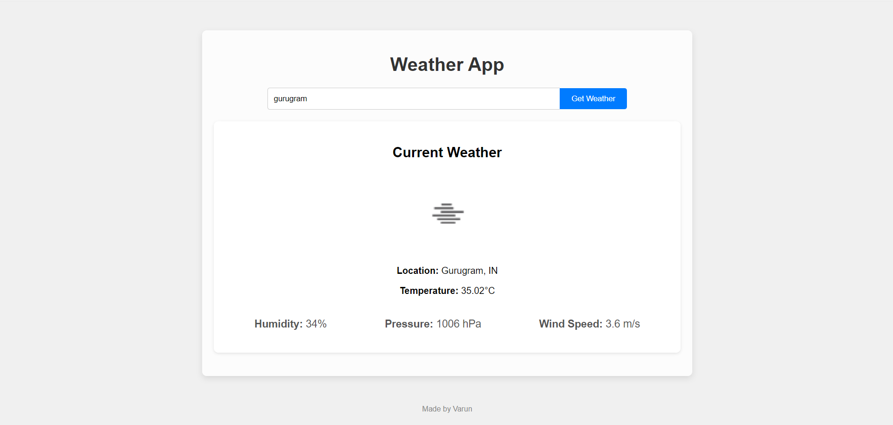

# Simple Weather App

## Overview
A minimalist weather application that allows users to quickly retrieve current weather data for any location. Built with HTML, CSS, and JavaScript, this app fetches weather information from the OpenWeatherMap API and displays it in a user-friendly interface.

## Features
- Input field to enter the desired location.
- Button to fetch weather data for the entered location.
- Display of current weather conditions including temperature, humidity, pressure, and wind speed.
- Responsive design for optimal viewing on various devices.

## Demo
[Link to live demo](#) *(Replace this with the actual link when you deploy the app)*

## Screenshots

## Installation
1. Clone the repository: `git clone https://github.com/yourusername/weather-app.git`
2. Navigate to the project directory.
3. Open `index.html` in your preferred web browser.

## Usage
1. Enter the desired location in the input field.
2. Click the "Get Weather" button to fetch weather data.
3. View the current weather details displayed on the screen.

## Dependencies
- None

## API Used
- [OpenWeatherMap API](https://openweathermap.org/api)

## Contributing
Contributions are welcome! Feel free to submit pull requests or open issues for any bugs or feature requests.

## Credits
- Weather data provided by [OpenWeatherMap](https://openweathermap.org/).
- Icons made by [Freepik](https://www.freepik.com) from [Flaticon](https://www.flaticon.com/).
